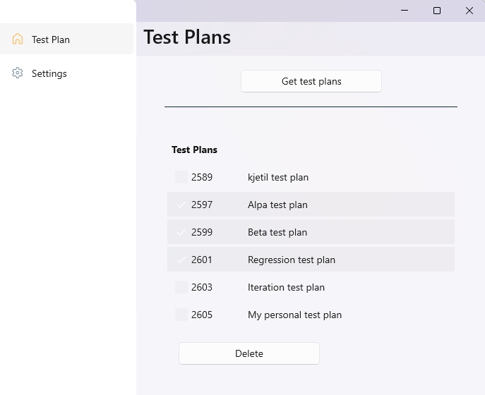

# ADO Manager
This tool is a support tool for users of Azure DevOps to make everyday life a little easier.

#### Functionality
- Settings (configure connection to azure devops)
- TestPlan (list testplans and multiselect delete)

## Disclaimer
Made for my personal use, without focus on ux, robustness and quality. Feel free to use, but at your own risk. No guaranties :-)

## Developers
This is a simple .NET MAUI project learning cross platform development. 
Demonstrate MVVM pattern using Community Toolkit and support different ux for Phone, tablets and desktops.
Also show simple storage by using preference and secure storage for access token.

## Screenshots
### Phone

### Desktop and tablets

